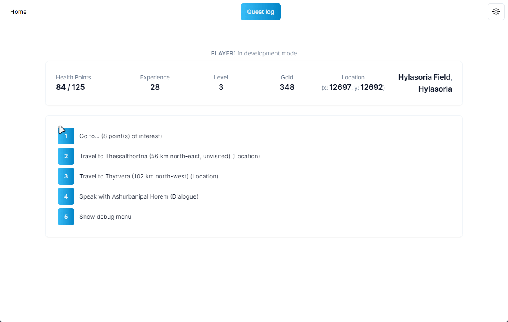
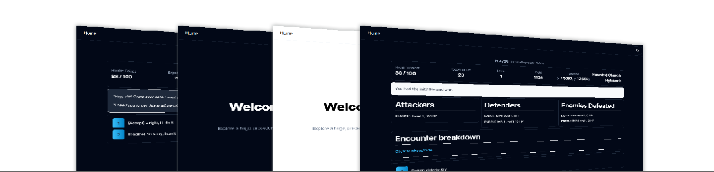

# Procedural Generation 1 Frontend

This repository contains the frontend for
the [Procedural Generation 1](https://github.com/kimgoetzke/procedural-generation-1) project. It is a Next.js 14
application that uses Typescript, Shadcn, Lucide React, Tailwind CSS, and Zustand. The purpose of this project was to
improve my frontend development skills e.g. by using common front-end technologies I hadn't used before and by using a
common front-end components/features such as data tables, light/dark modes, reusable components.



## How to run

### Running with the backend (recommended)

First, start up the backend server. In development, the frontend expects the backend to be running on `localhost:8080`.
Instructions can be found here: [Procedural Generation 1](https://github.com/kimgoetzke/procedural-generation-1).

Then, run the frontend development server:

```shell
npm run dev
```

Open [http://localhost:3000](http://localhost:3000) with your browser to see the result.

### Running without the backend

If you want to run the frontend without spinning up the backend, all you can do at this point is:

1. Open `/src/app/api/play/route.ts` and return the provided `testBody` instead of making API calls*
2. Open `/src/app/api/quest-log/route.ts` and return the provided `testBody` instead of making API calls*
3. Run the development server with:

```shell
npm run dev
```

*You can do this by commenting out any `fetch` and the return statement, and returning `NextResponse.json(testBody)`
instead. By doing this, you will, of course, always return the same response, regardless of the backend call made. For
the `play` routes, you can then change the `viewType` of the `testBody` to see different views/screens and work on them.



## Limitations

This project has many limitations. It was a practice project and was never intended to become a polished website. Some
of the limitations are:

1. No authentication has been implemented. Currently, the game uses hardcoded credentials for `player1`. This is
   partially because the backend also doesn't really user sign-up, etc. However,
   see [github.com/kimgoetzke/practice-next-auth](https://github.com/kimgoetzke/practice-next-auth) for a project where
   I implemented authentication using NextAuth.
2. You must run the
   backend ([github.com/kimgoetzke/procedural-generation-1](https://github.com/kimgoetzke/procedural-generation-1))
   locally alongside the frontend.
3. Playing the "game" requires the player to be new or to have a `webPlayer` cookie (dropped after first login). If this
   cookie is deleted, the player can no longer play the game (at least not without rebooting the backend).
4. The UX is lacking (e.g. too many clicks) because the backend was built as an CLI application. The UI is boring and
   unlikely to be following best practice for UI design. The application could be improved to feel more juicy (e.g.
   animations and colours) and accessible (e.g. better layout).

